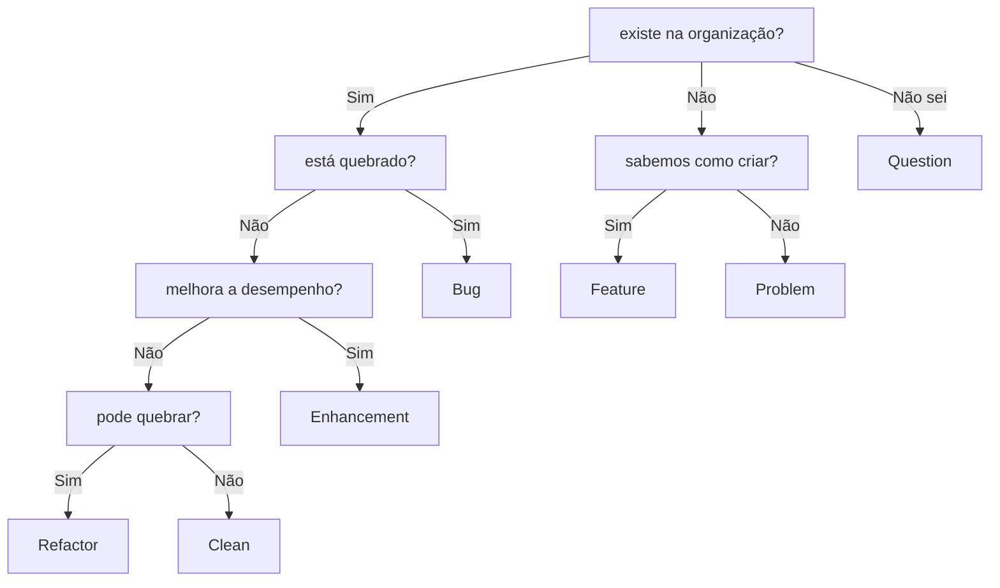

# style guide
Este guia é uma lista de convenções adotadas para como se escrever código/documentação/perguntas/sugestões durante o projeto.  
  
## language
- Inglês é a principal lingua do projeto. Se espera encontrar ela para:  
  - Titulos em documentações/issues  
  - Códigos em geral  
  - Git commits  
- Português é usado para textos que requerem mais clareza (documentações, issues, conversas)  
- Ninguém é perfeito então não espere encontrar gramática perfeita de ninguém, não importa o idioma.  
  - Não tenha medo de corrigir outros e de escrever algo errado, estamos todos aqui para aprender e melhorar  
  - O foco é caminhar para algo que muitos possam ler e entender  

## documentation
- A idéia é deixar a documentação o mais próxima possível de onde ela é usada e evitar repetição de documentação  
  - Explicação para uma linha do código deve ficar comentado a cima da linha  
  - Explicação para uma função do código deve ficar escrita no [docstring](https://en.wikipedia.org/wiki/Docstring)/[docblock](https://en.wikipedia.org/wiki/Docblock) da função  
  - Explicação para um repositório deve ficar no [README.md](https://en.wikipedia.org/wiki/README)  
- Todo repositório tem que ter o arquivo README.md  
  - Esse arquivo deve explicar **apenas** aquele repositório  
  - Esse arquivo não deve entrar em detalhes de outros repositórios da organização  
- Utilize [Mermaid Markdown](https://mermaid-js.github.io/mermaid/#/) para [diagramas](https://en.wikipedia.org/wiki/Diagram)  
  - Motivo: imagens não são fáceis de alterar (normalmente envolve em compartilhar algum arquivo antes de exportar para imagem)  

## issues
- Utilizamos as [issues](https://docs.github.com/en/issues) dos repositórios como principal modo de comunicação oficial  
- A issue deve ser criada no repositório relacionado ao assunto  
  - Se é um bug na API, crie no repositório da API  
  - Se é uma sugestão para um cron job, crie no repositório do cron job  
  - Caso não esteja relacionado a nenhum repositório, escolha o repositório onde este arquivo se encontra  
- Antes de criar, procure saber se a mesma issue já foi criada e se foi respondida  
  - Se foi criada mas não foi respondida, reviva a pergunta dentro daquela issue  
- Adicione uma das labels existentes na issue  

## labels
- Bug
- Enhancement
- Feature
- Problem
- Refactor
- Clean
- Question

## software design
- Em questões de [input/output](https://en.wikipedia.org/wiki/Input/output)  
  - Software responsável por receber os dados dita o formato em que quer receber os dados  
  - Software responsável por enviar os dados deve formatar de acordo com o ditado pelo receptor  
    - Cada transmissor vai provávelmente escrever seu próprio código para transmitir os dados, se o receptor tiver que adaptar para cada um destes formatos de dados nós podemos acabar com 2N códigos escritos. Para diminuir isto é recomendável que apenas os transmissores escrevam da maneira esperada pelo receptor, o que irá diminuir para N códigos escritos  

## python code
- [PEP 8](https://peps.python.org/pep-0008/) & [PEP 257](https://peps.python.org/pep-0257/)  
  - As convenções para escrever cóigo python são basicamente aquelas ditadas nos PEP  
  - Usar o formatador de texto **black** e **isort**  
