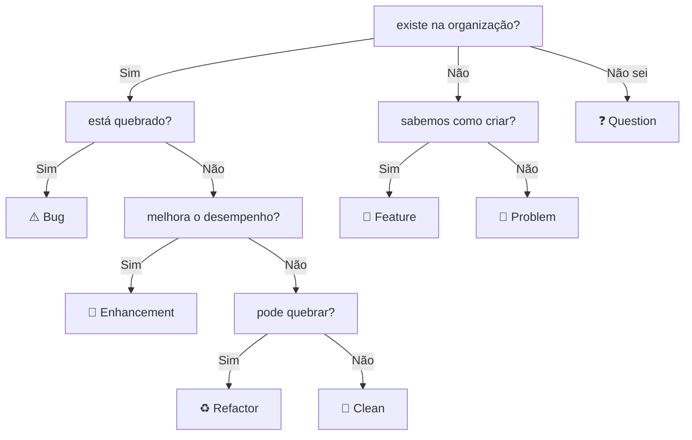

# issues
Utilizamos as [issues](https://docs.github.com/en/issues) dos repositórios como principal modo de comunicação oficial  

- Sempre adicione label nas issues  
- A issue deve ser criada no repositório relacionado ao assunto  
  - Se é um bug na API, crie no repositório da API  
  - Se é uma sugestão para um cron job, crie no repositório do cron job  
  - Se é um bug em um pacote, crie no repositório do pacote
  - Caso não esteja relacionado a nenhum repositório, escolha o repositório onde este mesmo arquivo se encontra  
- Antes de criar, procure saber se a mesma issue já foi criada e se foi respondida  
  - Se foi criada mas não foi respondida, reviva a pergunta dentro daquela issue  

## labels
- ⚠️ Bug
- 💎 Enhancement
- 🚀 Feature
- 🚩 Problem
- ♻️ Refactor
- 🧼 Clean
- ❓ Question

