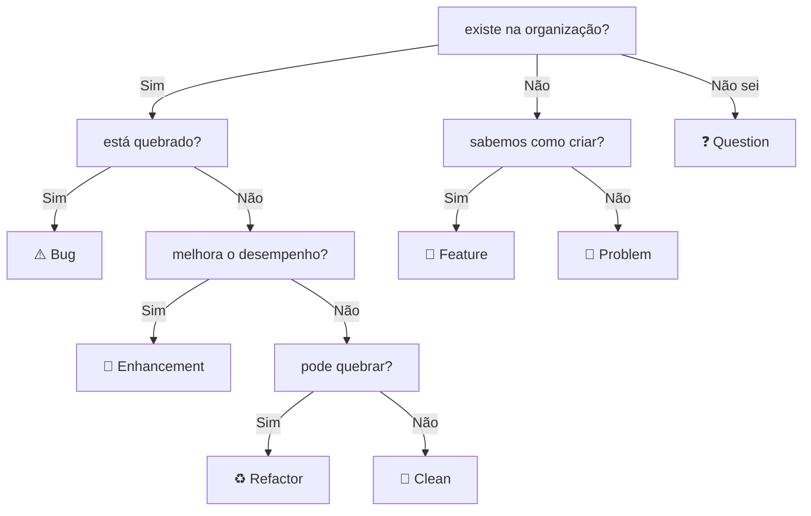

# issues
Utilizamos as [issues](https://docs.github.com/en/issues) dos repositórios como principal modo de comunicação oficial  

- Sempre adicione label nas issues  
  - Labels podem ser adicionadas ou alteradas com o tempo
- A issue deve ser criada no repositório relacionado ao assunto  
  - Se é um bug na API, crie no repositório da API  
  - Se é uma sugestão para um cron job, crie no repositório do cron job  
  - Se é uma refatoração no pacote, crie no repositório do pacote
  - Caso não esteja relacionado a nenhum repositório, escolha o repositório onde este arquivo se encontra  
- Antes de criar, procure saber se a mesma issue já foi criada e se foi respondida  
  - Se foi criada mas não foi respondida, reviva a pergunta dentro daquela issue  

## labels

Labels e exemplos de uso:
- ⚠️ Bug
  - Funcionalidade que parou de funcionar e é preciso de correção
    - Botão de remover produto parou de funcionar
    - Página incial não termina de carregar
- 💎 Enhancement
  - Alteração no código que buscam melhorar o desempenho
    - Utilizar generator em vez de lista
    - Alterar código para asssíncrono
- 🚀 Feature
  - Funcionalidade a ser implementada
    - Adicionar calculadora de GTIN
    - Adicionar botão de deletar
- 🚩 Problem
  - Problema que é necessária uma discussão para descobrir uma boa solução
    - Descobrir a cubagem de um produto
- ♻️ Refactor
  - Alteração no código que possuem foco em melhorar legibilidade e entendimento
    - Troca de `while` por `for in`
    - Adilçao de tipagem no código python
- 🧼 Clean
  - Alteração em textos que não afetam o código
    - Atualização de documentação
    - Atualização de comentário no código
- ❓ Question
  - Está perdido ou confuso? Precisa de ajuda? Essa label é justamente para quando você possui uma dúvida
    - Não escreva sugestões em formato de dúvidas. Todos estes casos podem cair dentro das outras labels e serem discutidos na issue se valem a pena ou não:
      - "Não seria melhor fazer A em vez de B?"
      - "Se usarmos arquitetura X o nosso código não vai ser mais rápido?"
      - "Por que não implementamos Y?"
    

